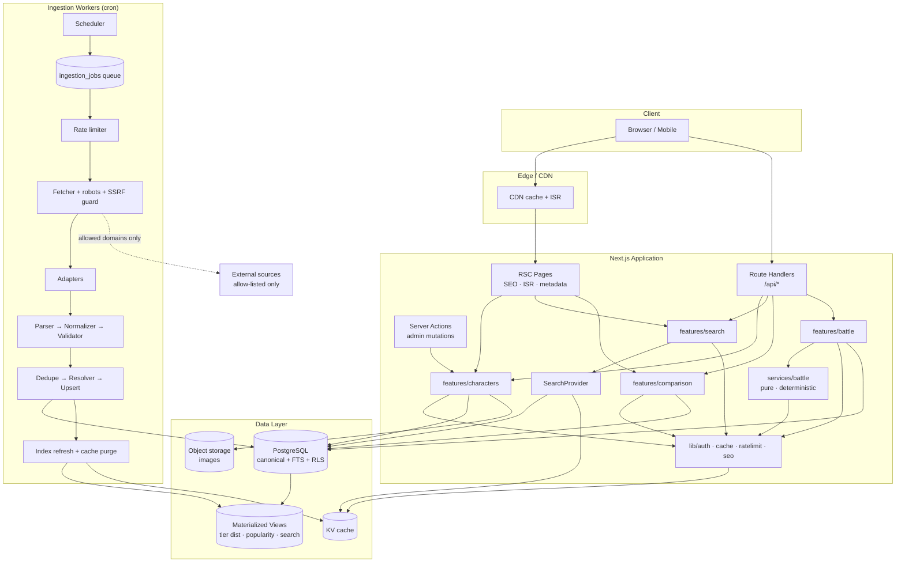
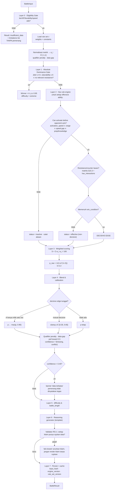
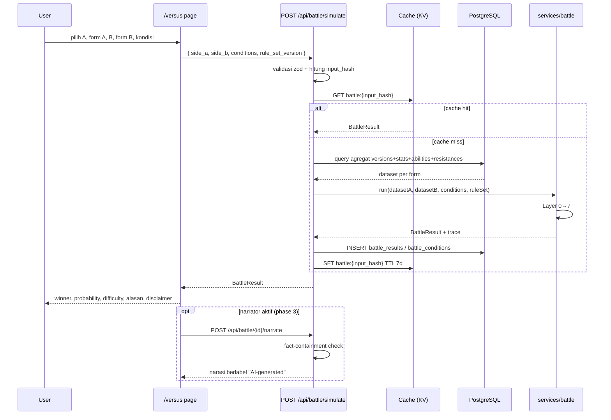
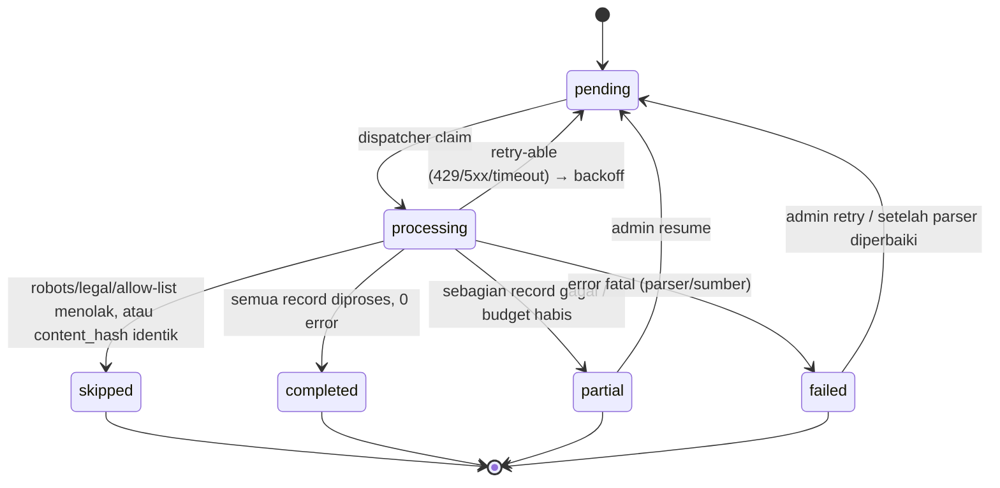
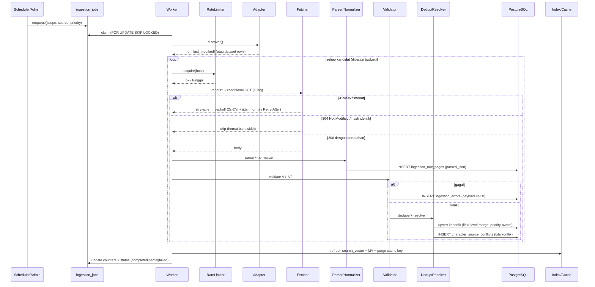
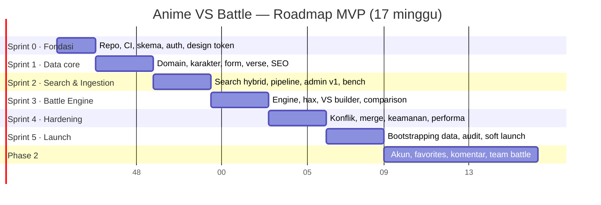

# Anime VS Battle — Appendices A–J

Dokumen pendamping [PRD.md](PRD.md). Berisi diagram, matriks, spesifikasi tabel, dan rencana kerja turunan.

**Isi**
- [A. System Architecture Diagram](#a-system-architecture-diagram)
- [B. Database ERD](#b-database-erd)
- [C. Data Flow Diagram](#c-data-flow-diagram)
- [D. Battle Engine Flow](#d-battle-engine-flow)
- [E. Ingestion Pipeline Flow](#e-ingestion-pipeline-flow)
- [F. MVP Feature Matrix](#f-mvp-feature-matrix)
- [G. API Endpoint Table](#g-api-endpoint-table)
- [H. Database Table Specification](#h-database-table-specification)
- [I. User Journey](#i-user-journey)
- [J. Development Roadmap](#j-development-roadmap)
- [K. Case Library Battle Engine (format data)](#k-case-library-battle-engine-format-data)

---

## A. System Architecture Diagram

### A.1 Gambaran lapisan

```
╔══════════════════════════════════════════════════════════════════════════════════╗
║ CLIENT (browser / mobile)                                                        ║
║  Public pages (RSC) · Admin console · Share/OG cards                            ║
╚═══════════════════════════════════┬══════════════════════════════════════════════╝
                                    │ HTTPS (edge, CDN cache, ISR)
╔═══════════════════════════════════▼══════════════════════════════════════════════╗
║ APPLICATION LAYER — Next.js on Vercel (edge + node runtimes)                     ║
║ ┌───────────────────────┐ ┌────────────────────────┐ ┌────────────────────────┐  ║
║ │ RSC pages             │ │ Route handlers  /api/*  │ │ Server actions         │  ║
║ │ (SEO, ISR, metadata)  │ │ (public + admin)        │ │ (admin mutations)      │  ║
║ └──────────┬────────────┘ └───────────┬────────────┘ └───────────┬────────────┘  ║
║            ▼                          ▼                          ▼               ║
║ ┌────────────────────────────────────────────────────────────────────────────┐   ║
║ │ DOMAIN / FEATURE LAYER  (features/*, lib/*)                                │   ║
║ │ characters · verses · search · comparison · battle                          │   ║
║ └──────┬───────────────────────────────┬───────────────────────┬─────────────┘   ║
║        │                               │                       │                 ║
║ ┌──────▼───────────┐        ┌──────────▼──────────┐   ┌────────▼──────────────┐  ║
║ │ services/battle  │        │ SearchProvider       │   │ lib/{auth,seo,        │  ║
║ │ (PURE, no I/O)   │        │ (postgres → external)│   │  cache,ratelimit}     │  ║
║ │ engine·hax·score │        └──────────┬───────────┘   └────────┬──────────────┘  ║
║ └──────┬───────────┘                   │                        │                 ║
╚════════│═══════════════════════════════│════════════════════════│═════════════════╝
         │                               │                        │
         ▼                               ▼                        ▼
╔════════════════════════════════════════════╗   ╔════════════════════════════════╗
║ POSTGRESQL (Supabase) — sumber kebenaran   ║   ║ CACHE / KV (Upstash)           ║
║  canonical tables · FTS+trgm index         ║   ║ search suggest · version cache ║
║  materialized views · RLS · RPC functions  ║   ║ battle cache by input_hash     ║
╚════════════▲═══════════════════════════════╝   ╚════════════════════════════════╝
             │ SQL via service role (server only)
╔════════════╧══════════════════════════════════════════════════════════════════════╗
║ INGESTION / WORKER LAYER (cron-triggered, never on request path)                 ║
║  Scheduler → Job queue (ingestion_jobs) → Rate limiter → Fetcher (robots/ETag)    ║
║      → Adapters (dataset | manual URL | allow-listed source)                      ║
║      → Parser → Normalizer → Validator → Dedupe → Resolver → Upsert               ║
║      → Index refresh + cache invalidation                                         ║
╚══════════════════════════════════════════════════════════════════════════════════╝
             │ conditional HTTP GET (allow-list domains only, SSRF-guarded)
╔════════════▼══════════════════════════════════════════════════════════════════════╗
║ EXTERNAL SOURCES (opt-in, legal_status = allowed)                                 ║
║  licensed datasets · official APIs · approved pages · admin uploads               ║
╚══════════════════════════════════════════════════════════════════════════════════╝
```

### A.2 Diagram komponen (Mermaid)



### A.3 Alasan pembagian lapisan

| Lapisan | Tanggung jawab | Alasan dipisahkan |
|---|---|---|
| Client | Interaksi & render | `<120 KB` JS per halaman; tidak ada logika bisnis |
| Edge/CDN | Cache & ISR | Konten data jarang berubah; menurunkan TTFB dan beban DB |
| RSC pages | Render server-side + SEO | HTML awal harus berisi konten (kebutuhan crawler) |
| Route handlers | Kontrak API stabil | Dipakai juga oleh admin & (nanti) public API |
| Domain/features | Aturan produk | Berbagi antara halaman & API tanpa duplikasi |
| `services/battle` | Kalkulasi murni | Mudah diuji, deterministik, tanpa I/O (dienforce lint) |
| `SearchProvider` | Abstraksi pencarian | Upgrade Postgres → engine eksternal tanpa mengubah API |
| Ingestion workers | Ambil & normalisasi data | Isolasi beban; kepatuhan & rate limit terkontrol satu tempat |
| Data layer | Kebenaran & kecepatan | Index + MV + RLS dalam satu mesin (hemat, aman) |

---

## B. Database ERD

### B.1 ERD inti

```mermaid
erDiagram
  verses ||--o{ characters : "memiliki"
  characters ||--o{ character_aliases : "punya alias"
  characters ||--o{ character_versions : "punya form"
  characters ||--o{ character_sources : "dirujuk sumber"
  characters ||--o{ character_source_conflicts : "punya konflik"
  characters ||--o{ merge_candidates : "kandidat merge"
  characters ||--o{ data_reports : "dilaporkan"
  characters ||--o{ analytics_events : "opsional"

  character_versions ||--o{ statistics : "punya nilai stat"
  character_versions ||--o{ character_abilities : "punya ability"
  character_versions ||--o{ character_resistances : "punya resistensi"
  character_versions ||--o{ feats : "punya feat"
  character_versions ||--o{ equipment : "punya equipment"
  character_versions }o--|| tiers : "ber-tier"
  character_versions ||--o{ battle_results : "side_a"
  character_versions ||--o{ battle_results : "side_b"

  stat_scale_metrics ||--o{ stat_scales : "mendefinisikan"
  stat_scales ||--o{ statistics : "dipakai"
  stat_scales ||--o{ character_versions : "cache kolom metrik"

  ability_categories ||--o{ abilities : "mengklasifikasi"
  ability_categories ||--o{ hax_interactions : "sumber ability"
  abilities ||--o{ character_abilities : "dimiliki"
  abilities ||--o{ hax_interactions : "spesifik"

  resistance_types ||--o{ character_resistances : "dimiliki"
  resistance_types ||--o{ hax_interactions : "target resistensi"

  sources ||--o{ source_snapshots : "riwayat fetch"
  sources ||--o{ ingestion_jobs : "sumber job"
  sources ||--o{ character_sources : "atribusi"
  sources ||--o{ statistics : "asal nilai"
  sources ||--o{ character_abilities : "bukti"
  sources ||--o{ character_resistances : "bukti"
  sources ||--o{ feats : "bukti"
  sources ||--o{ abilities : "asal definisi"
  sources ||--o{ character_source_conflicts : "pihak konflik"

  ingestion_jobs ||--o{ ingestion_errors : "punya error"
  ingestion_jobs ||--o{ ingestion_raw_pages : "staging hasil"

  battle_rule_sets ||--o{ battle_results : "versi aturan"
  battle_conditions ||--o{ battle_results : "kondisi"
  battle_results ||--o{ battle_narratives : "narasi AI (phase 3)"
  battle_results ||--o{ favorites : "disimpan"

  users ||--o{ user_roles : "punya role"
  users ||--o{ favorites : "menyimpan"
  users ||--o{ audit_logs : "melakukan aksi"
  users ||--o{ data_reports : "review laporan"
```



### B.2 Relasi penting dan alasannya

| Relasi | Kardinalitas | Konsekuensi desain | Alasan |
|---|---|---|---|
| `verses → characters` | 1—n | Hapus verse = tolak bila masih ada karakter (`ON DELETE RESTRICT`) | Mencegah kehilangan data massal tak sengaja |
| `characters → character_versions` | 1—n (min 1, tepat 1 default) | Partial unique index `WHERE is_default` | Menjamin UX deterministik (FR-1) |
| `character_versions → statistics` | 1—n (per metric per source) | `UNIQUE(character_version_id, metric, source_id, status)` untuk `status='current'` | Memungkinkan multi-sumber & riwayat tanpa duplikasi logis |
| `character_versions → tiers` | n—1 | `ON DELETE RESTRICT` + wajib `tier_id` | Form tanpa tier tidak dapat dipertarungkan |
| `character_versions → abilities` | n—n via `character_abilities` | Unik `(version, ability)`; `ON DELETE CASCADE` pada version | Ability harus reusable lintas karakter (AB-1) |
| `character_versions → resistance_types` | n—n via `character_resistances` | Unik `(version, type)` | Satu tipe resistensi satu nilai per form |
| `hax_interactions` | tabel aturan | Unik `(ability_category_id, resistance_type_id)` | Hot path rule engine; harus deterministik & bebas duplikasi |
| `battle_results → character_versions` | n—1 ×2 (`side_a`, `side_b`) | `ON DELETE RESTRICT` bila form punya hasil tersimpan | Auditabilitas hasil lama (FR-5) |
| `battle_results → battle_rule_sets` | n—1 | Menyimpan versi aturan | Reproduksibilitas (AC-14, AC-28) |
| `sources → semua tabel fakta` | 1—n | `NOT NULL` untuk fakta (`source_id`) | Traceability wajib (AC-09) |
| `users → user_roles` | 1—n | Role dibaca RLS helper `is_admin()` | Role-based access (§28) |
| `battle_conditions → battle_results` | 1—n | Di-cascade dari battle | Kondisi tidak bermakna tanpa hasil |

### B.3 Catatan RLS (ringkas)

| Tabel | anon | authenticated (#Phase2) | curator | admin |
|---|---|---|---|---|
| `characters`, `verses`, `character_versions`, `statistics`, `abilities`(baca), `feats` | SELECT | SELECT | SELECT + UPDATE | ALL |
| `battle_results`, `battle_conditions` | SELECT + INSERT (via RPC server) | SELECT | SELECT | ALL |
| `sources`, `ingestion_*`, `character_source_conflicts`, `merge_candidates`, `audit_logs` | — | — | SELECT/UPDATE (conflicts, merges) | ALL |
| `data_reports`, `analytics_events` | INSERT (rate-limited, tanpa PII) | INSERT | SELECT | ALL |
| `users`, `user_roles` | — | SELECT milik sendiri | SELECT sendiri | ALL |

Prinsip: tulisan pengguna anonim hanya melalui route handler dengan service role + validasi, bukan langsung ke tabel. RLS menjadi lapisan kedua, bukan satu-satunya.

---

## C. Data Flow Diagram

### C.1 Level 0 — konteks

```
                        ┌────────────────────────────┐
   Visitor ────────────▶│                            │──────────▶ HASIL: halaman, comparison,
   (anon)               │      ANIME VS BATTLE       │            battle result, share card
                        │                            │
   Admin ──────────────▶│                            │──────────▶ Laporan ingestion, konflik, audit
   (curator/admin)      │                            │
                        └───────┬──────────┬─────────┘
                                │          │
                 data tersimpan │          │ impor & sinkronisasi (opt-in, allow-listed)
                                ▼          ▼
                        ┌─────────────┐  ┌──────────────────────────┐
                        │ PostgreSQL  │  │ Sumber eksternal         │
                        │ + FTS + MV  │  │ (dataset/API/halaman)    │
                        └─────────────┘  └──────────────────────────┘
```

### C.2 Level 1 — alur baca (read path)

```
User
 │  1. pilih karakter A & B + form
 ▼
[/versus] UI
 │  2. submit simulasi
 ▼
Route handler POST /api/battle/simulate
 │  3. validasi body (zod) → BattleInput
 │  4. hitung input_hash = sha256(versions + conditions + rule_set_version)
 ▼
Cache lookup (KV / battle_results.input_hash)
 ├── HIT ─▶ 9. render hasil (RSC) → user
 └── MISS
      │  5. query agregat: versions + statistics + abilities + resistances + feats
      ▼
   services/battle engine (Layer 0–7, murni)
      │  6. BattleResult
      ▼
   Persist: battle_results (+ conditions, engine_version, rule_set_version)
      │  7. invalidation hanya untuk key relevan (tidak ada flush global)
      ▼
   KV cache write (TTL 7 hari) ─▶ 9. render hasil
```

### C.3 Level 1 — alur tulis (write path / ingestion)

```
Cron / Admin
 │  1. enqueue job (scope, source, priority)
 ▼
ingestion_jobs (status=pending, next_attempt_at)
 │  2. dispatcher claim: SELECT ... FOR UPDATE SKIP LOCKED WHERE status='pending'
 ▼
Worker
 │  3. rate limiter (token bucket per host) → tunggu bila penuh
 │  4. robots.txt check (cache 24h; fail-closed) + SSRF guard (domain allow-list, blok IP privat)
 │  5. conditional GET (ETag/Last-Modified) dengan timeout + retry backoff
 │  6. content_hash bandingkan dengan source_snapshots
 │       ├─ identik ─▶ status=skipped (end)
 │       └─ berbeda
 │  7. parse → parsed_json (staging ingestion_raw_pages)
 │  8. normalize → schema internal (raw_text + nilai ternormalisasi)
 │  9. validate (V1–V9) → lulus / tolak (ingestion_errors)
 │ 10. dedupe & resolve → same char? form baru? varian? kandidat merge?
 │ 11. upsert kanonik (field-level merge dengan source_priority; konflik → conflicts table)
 │ 12. update search_vector, refresh MV terpengaruh, purge cache key terkait
 │ 13. finalisasi job: counters + status (completed|partial|failed)
 ▼
Admin dashboard: progres, error, diff
```

### C.4 Klasifikasi data di setiap titik (data contract)

| Titik | Bentuk data | Kepercayaan | Catatan |
|---|---|---|---|
| Sumber eksternal | HTML/JSON mentah milik pihak lain | Tidak dipercaya | Tidak pernah masuk DB kanonik langsung |
| `ingestion_raw_pages.parsed_json` | JSONB hasil parser | Tidak dipercaya | Staging; dapat di-reparse tanpa fetch ulang |
| Setelah normalize | Schema internal + `raw_text` asli | Terverifikasi struktural | `raw_text` selalu dipertahankan (SR-1) |
| Setelah validate | Record lolos V1–V9 | Valid secara skema | Field fakta fail-closed |
| Tabel kanonik | Data siap tayang + `source_id` | `verified/imported/partial/conflicting` | Traceable & dapat di-rollback |
| `battle_results` | Turunan analitis | Simulasi, bukan fakta | Selalu berlabel; tidak pernah menulis balik ke tabel fakta |

---

## D. Battle Engine Flow

### D.1 Flowchart keputusan



### D.2 Diagram urutan (sequence)



### D.3 Traceability: setiap angka punya asal

| Keluaran | Sumber data | Dapat diaudit? |
|---|---|---|
| `a_i` per metrik | `statistics` (+ `stat_scales.rank`) | Ya — ditampilkan di `score_breakdown` |
| `contribution` | `a_i × weight` | Ya — aritmetika terbuka |
| `decisive_edges[].status` | `hax_interactions` + `character_resistances.level` | Ya — merujuk `interaction_id` |
| `qualifier_penalty` | `statistics.qualifier` | Ya |
| `confidence` | jumlah metrik hilang, konflik terbuka, kualitas data | Ya — ditampilkan sebagai komponen |
| Reasoning | Template + pointer ke breakdown/edges/limitations | Ya — validator RG-1 |

**Aturan emas:** jika sebuah keluaran tidak dapat ditelusuri ke baris database, keluaran itu tidak boleh ditampilkan.

---

## E. Ingestion Pipeline Flow

### E.1 State machine job



**Aturan status:** `completed` hanya bila `records_failed = 0` **dan** tidak ada halaman yang dilewati karena error. Jika ada satu halaman gagal tetapi sisanya sukses → `partial`, dan job tetap dapat di-resume.

### E.2 Sequence pipeline



### E.3 Titik resumability

| Tahap | Bagaimana resume bekerja | Efek menghindari |
|---|---|---|
| Discovery | `ingestion_jobs.cursor` menyimpan URL terakhir / offset dataset | Mengulang dari awal |
| Fetch | `source_snapshots.content_hash` + ETag | Fetch ulang halaman tak berubah |
| Parse | `ingestion_raw_pages.parsed_json` tersimpan | Fetch ulang saat parser diperbaiki |
| Validate | Record yang gagal dicatat per-record, bukan menggagalkan batch | Kehilangan progres |
| Upsert | Idempoten + `ON CONFLICT` | Duplikasi saat re-run |

### E.4 Matriks kepatuhan per tahap

| Tahap | Kontrol kepatuhan | Konsekuensi bila kontrol gagal |
|---|---|---|
| Discovery | Hanya URL dari adapter yang `legal_status = allowed` | Job `skipped` + alasan |
| Robots | Cache 24 jam, fail-closed | Job `skipped` |
| Rate limiting | 1 req/s/host, burst 3, concurrency ≤ 2 | Job `partial` + `RateLimited` |
| Fetch | UA jelas dengan URL kontak, tanpa header penyamaran | — |
| Retry | Maks 5, backoff eksponensial + jitter, hormati `Retry-After` | `SourceUnavailable` |
| Snapshot | Simpan hash + excerpt ≤ 400 char, bukan arsip penuh | — |
| Attribution | `source_id` wajib sebelum masuk kanonik | Record ditolak |
| Kill switch | `legal_status = disabled` menghentikan semua job sumber | Job `skipped` |
| SSRF | Allow-list domain + blokir IP privat/loopback/link-local, tolak redirect lintas host | Request ditolak |

---

## F. MVP Feature Matrix

| # | Fitur | Prio | Effort | Dependensi | Risiko | Metrik verifikasi | Sprint |
|---|---|---|---|---|---|---|---|
| F-01 | Character database | P0 | M | Skema + migrasi | Rendah | ≥ 10k record; AC-07 | 1 |
| F-02 | Form/version | P0 | M | F-01 | Sedang (model data) | AC-02 | 1 |
| F-03 | Tier system | P0 | S | Skema | Rendah | Tier dapat di-CRUD tanpa deploy | 1 |
| F-04 | Qualifier support | P0 | M | F-03, F-05 | Sedang (semantik) | AC-29 | 1/3 |
| F-05 | Stat system | P0 | L | F-03 | Sedang | AC-04 | 1 |
| F-06 | Ability database | P0 | M | Katalog kategori | Sedang (kurasi) | AC-06 | 1 |
| F-07 | Resistance database | P0 | M | F-06 | Sedang | AC-06 | 1 |
| F-08 | Feats & evidence | P0 | S | F-01 | Rendah | AC-09, AC-12 | 1 |
| F-09 | Search (fuzzy, alias) | P0 | L | F-01, index | Sedang | AC-01 | 2 |
| F-10 | Filter & sort server-side | P0 | M | F-01, F-05 | Sedang (index) | AC-07, AC-24 | 1/2 |
| F-11 | Verse pages | P0 | M | MV distribusi | Rendah | AC-12 (blok verse) | 1 |
| F-12 | VS builder | P0 | M | F-02 | Rendah | AC-05 | 3 |
| F-13 | Comparison mode | P0 | S | F-05 | Rendah | AC-03, AC-04 | 3 |
| F-14 | Battle engine | P0 | XL | F-05, F-06, F-07, rule set | Tinggi (kualitas hasil) | AC-06, AC-28, AC-31–34 | 3 |
| F-15 | Hax interaction engine | P0 | L | F-06, F-07 | Tinggi (kurasi aturan) | AC-06 | 3 |
| F-16 | Battle result + share | P0 | M | F-14 | Rendah | AC-13, AC-14 | 3 |
| F-17 | Ingestion pipeline | P0 | XL | Skema + adapter | Tinggi (R1, R2) | AC-08, AC-10 | 2 |
| F-18 | Source traceability | P0 | S | F-17 | Rendah | AC-09 | 2 |
| F-19 | Conflict handling | P0 | M | F-17 | Sedang | AC-15 | 4 |
| F-20 | Duplicate detection | P0 | L | F-17 | Tinggi (akurasi) | AC-16 | 2/4 |
| F-21 | Admin dashboard | P0 | L | F-17, auth | Rendah | AC-10, AC-17 | 2/4 |
| F-22 | SEO | P0 | M | F-01, F-11 | Rendah | AC-11, AC-22 | 1/5 |
| F-23 | Image handling + licensing | P0 | S | F-01 | Sedang (legal) | AC-20 | 1 |
| F-24 | Analytics anonim | P1 | S | Acara inti | Rendah | Event tercatat tanpa PII | 3/4 |
| F-25 | Battle history (anonim) | P1 | S | F-16 | Rendah | Recent battles tampil | 4 |
| F-26 | Popular battles | P1 | S | F-24 | Rendah | Homepage dari data agregat | 4 |
| F-27 | Report data | P1 | S | F-01 | Rendah | Tiket masuk & terlihat | 4 |
| F-28 | Rule set editor | P1 | M | F-14 | Sedang | Preview dampak berfungsi | 4 |
| F-29 | Merge workflow | P1 | M | F-20 | Sedang | Merge + redirect 301 | 4 |
| F-30 | AI narrator | P2 | L | F-14 | Tinggi (halusinasi) | Fact-containment pass ≥ 99% | Phase 3 |
| F-31 | Team battle | P2 | L | F-14 | Sedang | 2v2 menghasilkan hasil valid | Phase 2 |
| F-32 | Akun & favorites | P2 | M | Auth publik | Rendah | Favorit persist | Phase 2 |
| F-33 | Voting & komentar | P2 | L | F-32, moderasi | Sedang | Community view terpisah dari engine | Phase 2 |
| F-34 | Turn-based simulation | P3 | XL | F-14 | Tinggi (determinisme) | Seeded RNG reproducible | Phase 3 |

Skala effort: S ≤ 3 hari · M ≈ 1 minggu · L ≈ 2 minggu · XL ≥ 3 minggu.

**Urutan implementasi yang direkomendasikan (kritikal):** F-03 → F-05 → F-02 → F-01 → F-17/F-18 → F-09/F-10 → F-21 → F-06/F-07 → F-14/F-15 → F-12/F-13/F-16 → F-19/F-20 → hardening.

---

## G. API Endpoint Table

Konvensi umum: semua respons JSON; error `{ error: { code, message, details? } }`; list mengembalikan `{ data, page, per_page, total, has_more }`; `per_page ∈ {20,50,100,200}` (cap 200); parameter tidak dikenal ditolak 400.

| # | Method | Path | Auth | Request (ringkas) | Response (ringkas) | Cache | Rate limit | Lokasi kode |
|---|---|---|---|---|---|---|---|---|
| 1 | GET | `/api/characters` | anon | `?q&tier&verse&media&gender&form&ability&resistance&speed&ap&sort&page&per_page` | daftar karakter ringkas | `s-maxage=300, swr=3600` | 120/min/IP | `app/api/characters/route.ts` |
| 2 | GET | `/api/characters/:slug` | anon | — | karakter + form ringkas + sumber | `s-maxage=600, swr=86400` | 120/min | idem |
| 3 | GET | `/api/characters/:slug/versions` | anon | — | daftar form + tier/stat ringkas | `s-maxage=600` | 120/min | `…/[slug]/versions/route.ts` |
| 4 | GET | `/api/characters/:slug/versions/:formSlug` | anon | — | form detail: stat, abilities, resistances, feats, equipment | `s-maxage=600` | 120/min | `…/[formSlug]/route.ts` |
| 5 | GET | `/api/verses` | anon | `?page&per_page&sort` | daftar verse + jumlah karakter | `s-maxage=3600` | 60/min | `app/api/verses/route.ts` |
| 6 | GET | `/api/verses/:slug` | anon | — | verse + distribusi tier + top karakter | `s-maxage=3600` | 60/min | `…/[slug]/route.ts` |
| 7 | GET | `/api/abilities` | anon | `?category&page` | katalog ability & kategori | `s-maxage=86400` | 60/min | `app/api/abilities/route.ts` |
| 8 | GET | `/api/resistances` | anon | `?page` | katalog tipe resistensi | `s-maxage=86400` | 60/min | `app/api/resistances/route.ts` |
| 9 | GET | `/api/tiers` | anon | — | ladder tier berurutan | `s-maxage=86400` | 60/min | `app/api/tiers/route.ts` |
| 10 | GET | `/api/search` | anon | `?q&limit&types=character,verse` | hasil hybrid FTS+trigram | `s-maxage=60` | 60/min | `app/api/search/route.ts` |
| 11 | GET | `/api/search/suggest` | anon | `?q` | ≤ 8 saran (prefix) | `s-maxage=60` | 300/min | `…/suggest/route.ts` |
| 12 | POST | `/api/battle/simulate` | anon* | `BattleInput` | `BattleResult` | no-store + cache `input_hash` | 30/min | `app/api/battle/simulate/route.ts` |
| 13 | GET | `/api/battle/:id` | anon | — | hasil tersimpan | `s-maxage=86400` | 120/min | `app/api/battle/[id]/route.ts` |
| 14 | GET | `/api/battle/:id/card` | anon | `?format=png` | OG card 1200×630 | `s-maxage=604800` | 60/min | `…/[id]/card/route.ts` |
| 15 | POST | `/api/battle/:id/narrate` | anon* | `{ style? }` | narasi berlabel AI | no-store | 10/min | Phase 3 |
| 16 | GET | `/api/compare` | anon | `?a&af&b&bf` | matriks perbandingan + indikator | `s-maxage=600` | 120/min | `app/api/compare/route.ts` |
| 17 | GET | `/api/matchups/popular` | anon | `?limit` | matchup populer (agregat) | `s-maxage=3600` | 60/min | `app/api/matchups/popular/route.ts` |
| 18 | POST | `/api/reports` | anon | `{ character_id, reason, details? }` | `{ report_id }` | — | 5/jam | `app/api/reports/route.ts` |
| 19 | GET | `/api/sitemaps/:type.xml` | anon | type ∈ characters, verses, versus, forms | sitemap chunk | `s-maxage=86400` | 10/min | `app/api/sitemaps/[type]/route.ts` |
| 20 | GET | `/api/health` | anon | — | status DB + cache + versi engine | no-store | 60/min | `app/api/health/route.ts` |
| 21 | POST | `/api/admin/ingestion/run` | admin | `{ scope, source_id?, verse_slug?, character_slug?, dry_run? }` | `{ job_id }` | — | 12/jam | `app/api/admin/ingestion/run/route.ts` |
| 22 | POST | `/api/admin/ingestion/import` | admin | `{ source_url }` atau multipart dataset | `{ job_id }` / `SOURCE_DISABLED` | — | 60/jam | `…/import/route.ts` |
| 23 | GET | `/api/admin/ingestion/jobs` | admin | `?status&source_id&page` | daftar job + counters | no-store | 300/jam | `…/jobs/route.ts` |
| 24 | POST | `/api/admin/ingestion/jobs/:id/retry` | admin | — | status baru | — | 120/jam | `…/jobs/[id]/retry/route.ts` |
| 25 | POST | `/api/admin/ingestion/jobs/:id/cancel` | admin | — | status `skipped` | — | 120/jam | `…/[id]/cancel/route.ts` |
| 26 | GET | `/api/admin/ingestion/jobs/:id/errors` | admin | `?error_type` | daftar error + payload | no-store | 300/jam | `…/[id]/errors/route.ts` |
| 27 | POST | `/api/admin/ingestion/jobs/:id/resume` | admin | — | lanjut dari cursor | — | 120/jam | `…/[id]/resume/route.ts` |
| 28 | POST | `/api/admin/characters/:id/reparse` | admin | `{ parser_version? }` | diff hasil | — | 60/jam | `app/api/admin/characters/[id]/reparse/route.ts` |
| 29 | PATCH | `/api/admin/characters/:id` | admin | field yang diubah + `source_id` | karakter terbaru | — | 300/jam | idem |
| 30 | PATCH | `/api/admin/versions/:id` | admin | stat/ability/resistance | versi terbaru | — | 300/jam | `…/versions/[id]/route.ts` |
| 31 | POST | `/api/admin/characters/:id/merge` | admin | `{ target_id, strategy }` | merge + 301 | — | 30/jam | `…/merge/route.ts` |
| 32 | GET | `/api/admin/merges` | admin | `?score_min` | kandidat merge | no-store | 300/jam | `app/api/admin/merges/route.ts` |
| 33 | POST | `/api/admin/merges/:id/resolve` | admin | `{ action: merge|keep_separate }` | hasil | — | 120/jam | `…/[id]/resolve/route.ts` |
| 34 | GET | `/api/admin/conflicts` | admin | `?status&page` | antrian konflik | no-store | 300/jam | `app/api/admin/conflicts/route.ts` |
| 35 | POST | `/api/admin/conflicts/:id/resolve` | admin | `{ resolution: keep_a|keep_b|keep_both|unresolved, note }` | hasil | — | 120/jam | `…/[id]/resolve/route.ts` |
| 36 | POST | `/api/admin/tiers` | admin | tier baru/reorder | ladder terbaru | — | 60/jam | `app/api/admin/tiers/route.ts` |
| 37 | POST | `/api/admin/abilities` | admin | ability/kategori | katalog terbaru | — | 120/jam | `app/api/admin/abilities/route.ts` |
| 38 | PUT | `/api/admin/hax-interactions/:id` | admin | `{ effectiveness, notes }` | aturan + dampak ke 20 battle sampel | — | 120/jam | `…/hax-interactions/[id]/route.ts` |
| 39 | PUT | `/api/admin/rule-sets/:version` | admin | `{ weights, constants }` (validasi Σw=100) | versi baru | — | 30/jam | `…/rule-sets/[version]/route.ts` |
| 40 | POST | `/api/admin/sources` | admin | registry sumber (url, license, rate limit) | sumber baru | — | 30/hari | `app/api/admin/sources/route.ts` |
| 41 | POST | `/api/admin/sources/:id/disable` | admin | `{ reason }` | kill switch aktif | — | 30/hari | `…/[id]/disable/route.ts` |
| 42 | GET | `/api/admin/metrics` | admin | — | ringkasan sistem | no-store | 300/jam | `app/api/admin/metrics/route.ts` |
| 43 | GET | `/api/admin/audit` | admin | `?actor&entity&page` | audit log | no-store | 300/jam | `app/api/admin/audit/route.ts` |

\* Endpoint publik yang mengizinkan POST dibatasi rate limit + (bila skor risiko tinggi) challenge bot. Semua endpoint publik memverifikasi `X-Robots-Tag: noindex, nofollow` pada respons API agar tidak menjadi konten duplikat.

**Endpoint yang sengaja TIDAK dibuat (dan alasannya)**

| Tidak dibuat | Alasan |
|---|---|
| `GET /api/export/all` | Melindungi data & biaya; mencegah kloning produk (D18) |
| `GET /api/characters?all=true` | Membebani server; melanggar prinsip "no full database to client" |
| `POST /api/admin/sql` | Tidak boleh ada kontrol query arbitrer dari klien (§28) |
| `GET /api/battle/stream` (SSE per pertarungan) | Simulasi < 300 ms — streaming tidak memberi nilai |
| Endpoint write publik pada karakter | Data fakta hanya diubah admin (integritas + anti-poisoning, R12) |

---

## H. Database Table Specification

Konvensi global: `id uuid primary key default gen_random_uuid()`, `created_at timestamptz not null default now()`, `updated_at timestamptz not null default now()` (trigger), nama snake_case, `ON DELETE` eksplisit di setiap FK. DDL lengkap: [schema.sql](schema.sql).

### H.1 Tabel inti domain

| Tabel | Kolom penting | Constraint / index | Alasan |
|---|---|---|---|
| `verses` | `id`, `slug` (uniq), `name`, `description`, `origin_media`, `popularity_score`, `source_id` | uniq(slug); idx(origin_media) | Pengelompokan karakter; halaman SEO `/verse/[slug]` |
| `characters` | `id`, `slug`(uniq), `name`, `native_name`, `description`, `origin`, `verse_id` FK→verses, `gender`, `age`, `classification`, `media_type`, `image_url`, `image_source`, `image_license`, `image_attribution`, `popularity_score`, `data_completeness`, `verification_status`, `source_url`, `source_name`, `source_last_updated`, `imported_at` | uniq(slug); GIN trgm(name); GIN search_vector; idx(verse_id); idx(verification_status) | Entitas identitas; `image_*` wajib berpasangan (LP-1) |
| `character_aliases` | `id`, `character_id` FK, `alias`, `script` enum(latin, kanji, kana, hangul, cyrillic), `is_primary` | uniq(character_id, alias); GIN trgm(alias) | Pencarian lintas bahasa & typo (AC-01) |
| `character_versions` | `id`, `character_id` FK, `slug`, `name`, `description`, `era`, `age_range`, `form_order`, `is_default`, `variant_of` FK self, `is_variant`, `media_type`, `tier_id` FK→tiers, `attack_potency_scale_id`, `durability_scale_id`, `speed_scale_id`, `striking_scale_id`, `lifting_scale_id`, `stamina_scale_id`, `range_scale_id`, `intelligence_scale_id`, `battle_iq_scale_id`, `experience_years`, `data_completeness`, `deleted_at` | uniq(character_id, slug); **partial uniq** `(character_id) WHERE is_default AND deleted_at IS NULL`; idx(character_id, tier_id); idx(speed_scale_id); idx(attack_potency_scale_id) | Unit pertarungan + cache stat untuk filter/sort tanpa join (D7) |
| `tiers` | `id`, `tier_code`(uniq), `tier_name`, `band`, `display_order`, `description`, `parent_tier` FK self, `numerical_rank`(uniq, nullable), `is_rankable` | uniq(tier_code); uniq(numerical_rank) | Ladder configurable (§12) |
| `stat_scale_metrics` | `id`, `metric`(uniq) enum(tier, attack_potency, durability, speed, reaction_speed, combat_speed, lifting_strength, striking_strength, range, stamina, intelligence, battle_iq, experience), `unit`, `direction` (higher_better), `normalization_span` | uniq(metric) | Definisi metrik & span normalisasi `N_i` (§17.1) |
| `stat_scales` | `id`, `metric_id` FK, `scale_code`(uniq per metric), `label`, `rank` (ordinal), `log_value` numeric, `band`, `is_rankable`, `notes` | uniq(metric_id, scale_code); idx(metric_id, rank) | Nilai komparabel + kuantifikasi opsional (§13.3) |
| `statistics` | `id`, `character_version_id` FK, `metric` enum, `scale_id` FK, `raw_text`, `qualifier` enum, `min_scale_id`, `max_scale_id`, `exact_value`, `confidence` numeric(3,2), `source_id` FK, `status` enum(current, superseded, conflicting), `notes` | **partial uniq** `(character_version_id, metric, source_id) WHERE status='current'`; idx(character_version_id, metric, status); CHECK confidence 0–1 | Kebenaran stat per sumber + riwayat (D6) |
| `ability_categories` | `id`, `slug`(uniq), `name`, `description`, `is_offensive`, `is_defensive`, `is_passive`, `parent_category` FK self | uniq(slug) | Taksonomi yang dipakai rule engine |
| `abilities` | `id`, `slug`(uniq), `name`, `category_id` FK, `description`, `default_level`, `activation_condition`, `activation_speed` enum(instant, fast, moderate, slow, triggered), `range_scale_id`, `cooldown`, `limitations`, `counters`, `is_offensive`, `is_defensive`, `is_passive`, `source_id` FK | uniq(slug); idx(category_id) | Katalog ternormalisasi (AB-1) |
| `character_abilities` | `id`, `character_version_id` FK, `ability_id` FK, `proficiency` enum, `level_notes`, `activation_notes`, `effective_range_scale_id`, `evidence_text` (≤400 char, CHECK), `source_id` FK, `verification_status`, `confidence` | uniq(character_version_id, ability_id); idx(ability_id) | Kepemilikan ability per form + bukti |
| `resistance_types` | `id`, `slug`(uniq), `name`, `category_id` FK→ability_categories, `description` | uniq(slug) | Katalog tipe resistensi |
| `character_resistances` | `id`, `character_version_id` FK, `resistance_type_id` FK, `level` smallint 0–4, `level_label` enum(none, limited, moderate, high, absolute), `description`, `evidence_text`, `source_id` FK, `verification_status` | uniq(character_version_id, resistance_type_id); CHECK level 0–4 | Input langsung rule engine (RS-1/RS-3) |
| `hax_interactions` | `id`, `ability_category_id` FK, `ability_id` FK nullable, `resistance_type_id` FK nullable, `relation` enum(effective, reduced, blocked, negated, bypasses), `effectiveness_multiplier` numeric(3,2), `requires_source_evidence` bool, `notes`, `rule_set_version` | uniq(ability_category_id, ability_id, resistance_type_id) NULLS NOT DISTINCT; idx(ability_category_id, resistance_type_id) | Rule engine sebagai data (D2) |
| `feats` | `id`, `character_version_id` FK, `feat_type` enum(ap, speed, durability, hax, skill, stamina, range, versatility), `description`, `significance` enum(minor, supportive, major, decisive), `source_id` FK, `evidence_text`, `verification_status` | idx(character_version_id, feat_type) | Bukti kuantitatif & kualitatif (AC-09) |
| `equipment` | `id`, `character_version_id` FK, `name`, `description`, `grants_ability_id` FK nullable, `source_id` FK | idx(character_version_id) | Form memperoleh ability via peralatan (qualifier `higher_with`) |
| `character_traits` | `id`, `character_version_id` FK, `trait` enum(in_character_aggression, prefers_talk, holds_back, tactical, reckless), `notes`, `source_id` | idx(character_version_id) | Dipakai mode `in_character` (§16.4) |

### H.2 Tabel sumber & ingestion

| Tabel | Kolom penting | Constraint / index | Alasan |
|---|---|---|---|
| `sources` | `id`, `slug`(uniq), `name`, `base_url`, `source_type` enum(wiki, api, dataset, manual_url, official), `priority` smallint 1–5, `legal_status` enum(allowed, restricted, disabled), `legal_reviewed_by`, `legal_reviewed_at`, `respect_robots` bool default true, `rate_limit_rps`, `max_fetches_per_day`, `license`, `license_url`, `attribution_text`, `is_active` | uniq(slug); CHECK license NOT NULL; idx(legal_status) | Registry sumber + kontrol kepatuhan (§18.3, IG-1..IG-7) |
| `source_snapshots` | `id`, `source_id` FK, `source_url`, `fetched_at`, `http_status`, `etag`, `last_modified`, `content_hash`, `parser_version`, `excerpt` (≤400 char), `byte_size`, `created_at` | uniq(source_id, source_url, content_hash); idx(source_id, fetched_at DESC) | Change detection + audit tanpa menyimpan arsip penuh (IG-5) |
| `character_sources` | `id`, `character_id` FK, `source_id` FK, `source_url`, `role` enum(identity, stats, abilities, resistances, feats, image), `imported_at` | uniq(character_id, source_id, role) | Atribusi per record; syarat AC-09 |
| `character_source_conflicts` | `id`, `character_id` FK, `character_version_id` FK nullable, `field`, `value_a`, `value_b`, `source_a_id` FK, `source_b_id` FK, `status` enum(open, resolved, ignored), `resolution`, `resolved_by` FK users, `resolved_at` | idx(status, character_id) | Konflik sebagai data, bukan overwrite (AC-15, D6) |
| `ingestion_jobs` | `id`, `job_id` (display), `source_id` FK, `scope` enum(incremental, scheduled_full, manual_run, single_character, single_verse, reparse, import_url, import_dataset), `target_ref` (slug/url), `status` enum(pending, processing, completed, partial, failed, skipped), `priority`, `started_at`, `completed_at`, `next_attempt_at`, `retry_count`, `max_retries`, `http_status`, `parser_version`, `error_message`, `error_type`, `records_found`, `records_created`, `records_updated`, `records_failed`, `cursor`, `dry_run`, `created_by` FK users | partial idx `(status, next_attempt_at) WHERE status IN ('pending','processing')`; idx(source_id, created_at DESC); idx(status) | Job queue + audit ingestion (§3, §18) |
| `ingestion_errors` | `id`, `job_id` FK, `source_url`, `error_type` enum(ParserError, SourceUnavailable, RateLimited, InvalidData, DuplicateCharacter, MissingRequiredField, ImageUnavailable, PolicyBlocked), `error_message`, `http_status`, `payload` jsonb (≤4 KB), `retry_count`, `created_at` | idx(job_id); idx(error_type, created_at DESC) | Diagnosis & reproduksi bug parser (§39) |
| `ingestion_raw_pages` | `id`, `job_id` FK, `source_id` FK, `source_url`, `parsed_json` jsonb, `parser_version`, `content_hash`, `fetched_at`, `expires_at` | uniq(source_url, content_hash, parser_version); idx(expires_at) | Staging + re-parse tanpa fetch ulang; retensi 90 hari |
| `merge_candidates` | `id`, `character_a_id` FK, `character_b_id` FK, `similarity_score` numeric(4,3), `signals` jsonb, `status` enum(pending, merged, rejected), `resolved_by` FK users, `resolved_at` | uniq(character_a_id, character_b_id) CHECK a<b; idx(status, similarity_score DESC) | Review manusia untuk skor 0,70–0,90 (§21) |

### H.3 Tabel battle & rule set

| Tabel | Kolom penting | Constraint / index | Alasan |
|---|---|---|---|
| `battle_rule_sets` | `id`, `version`(uniq), `weights` jsonb, `constants` jsonb, `active` bool, `notes`, `created_by` FK users | uniq(version); partial uniq `(active) WHERE active` | Aturan engine berversi & dapat diaudit (§17.3, BC-4) |
| `battle_conditions` | `id`, `mode` enum, `speed_equalized` bool, `starting_distance_scale_id` FK, `battlefield_id` FK, `knowledge_level` enum, `prep_time` enum, `win_condition` enum, `conditions_hash` | idx(conditions_hash) | Kondisi tersimpan agar hasil reproducible |
| `battles` (header) | `id`, `slug` (mis. `goku-vs-naruto`), `side_a_version_id` FK, `side_b_version_id` FK, `conditions_id` FK, `is_public` bool, `share_count`, `created_at` | **uniq(side_a_version_id, side_b_version_id, conditions_id)**; idx(slug); idx(created_at DESC); CHECK sisi A ≠ sisi B | Identitas matchup + permalink. Unik pada triplet karena slug yang sama dapat punya banyak kondisi; hasil tetap dapat dibedakan dan di-cache per `input_hash` (AC-14) |
| `battle_results` | `id`, `battle_id` FK→battles, `winner` enum(a, b, draw, insufficient_data), `win_probability_a`, `win_probability_b`, `confidence`, `difficulty` enum, `battle_length` enum, `score_breakdown` jsonb, `decisive_edges` jsonb, `primary_reason`, `secondary_factors` jsonb, `critical_counter`, `potential_scenario`, `limitations` jsonb, `assumptions` jsonb, `input_hash`(uniq), `engine_version`, `rule_set_version`, `computed_at`, `cached_until` | uniq(input_hash); idx(winner); idx(computed_at DESC) | Cache deterministik + history (AC-28) |
| `battle_narratives` | `id`, `battle_id` FK, `model`, `prompt_version`, `narrative`, `citation_coverage` numeric, `fact_check_passed` bool, `created_at` | idx(battle_id) | Output AI terpisah dari tabel fakta (§34) |
| `mv_battle_popularity` (MV) | `matchup_key`, `simulations`, `share_count`, `last_simulated_at`, `distinct_winners` | uniq(matchup_key); refresh tiap 1 jam | Popular battles tanpa hardcode (§31.4) |
| `character_traits` | `id`, `character_version_id` FK, `trait` enum, `notes`, `source_id` FK | uniq(character_version_id, trait) | Perilaku karakter untuk mode `in_character` (§16.4) |
| `mv_verse_tier_distribution` (MV) | `verse_id`, `tier_id`, `tier_code`, `numerical_rank`, `character_count`, `form_count` | uniq(verse_id, tier_id) | Halaman verse/homepage tanpa agregasi saat request |
| `mv_character_search` (MV) | `id`, `slug`, `name`, `aliases`, `verse_*`, `max_tier_rank`, `popularity_score` | uniq(id); GIN trigram pada nama | Jalur upgrade pencarian saat > 100k karakter (§37.2) |

### H.4 Tabel user, analytics, audit

| Tabel | Kolom penting | Constraint / index | Alasan |
|---|---|---|---|
| `users` | `id` (FK auth.users), `display_name`, `created_at` | — | Profil minimal (tanpa PII berlebih) |
| `user_roles` | `id`, `user_id` FK, `role` enum(viewer, curator, admin, owner) | uniq(user_id, role) | RBAC (§25.2) |
| `favorites` | `id`, `user_id` FK, `character_version_id` FK nullable, `battle_id` FK nullable, `created_at` | CHECK salah satu tidak null; uniq(user_id, character_version_id, battle_id) | Phase 2 |
| `analytics_events` | `id`, `name`, `props` jsonb, `actor_hash` (SHA-256 + salt harian), `created_at` | idx(name, created_at DESC); partition bulanan bila > 10 juta | Analitik tanpa PII (§31.1) |
| `audit_logs` | `id`, `actor_id` FK users, `action`, `entity_type`, `entity_id`, `before` jsonb, `after` jsonb, `ip_hash`, `created_at` | idx(entity_type, entity_id); idx(actor_id, created_at) | Forensik + reversibilitas (§19.4) |
| `data_reports` | `id`, `character_id` FK, `character_version_id` FK nullable, `field`, `reason_category`, `details`, `proposed_source_url`, `status` enum(new, reviewing, accepted, rejected), `reviewed_by` FK users, `report_count` | idx(status, created_at) | Jalur perbaikan data (US-10) |
| `slug_redirects` | `old_slug`(uniq), `entity_type`, `new_slug`, `created_at` | uniq(old_slug) | Merge/rename tetap mempertahankan SEO (§21 DR-3) |

### H.5 Trigger & job pemeliharaan

| Objek | Tipe | Fungsi | Alasan |
|---|---|---|---|
| `set_updated_at()` | trigger | Isi `updated_at` otomatis | Konsistensi |
| `sync_search_vector()` | trigger | Bangun `characters.search_vector` dari name + native_name + alias + verse + classification | Selalu akurat setelah perubahan (tanpa job tambahan) |
| `sync_version_stat_cache()` | trigger pada `statistics` | Perbarui kolom `<metric>_scale_id` di `character_versions` untuk `status='current'` | Menjamin cache = turunan sumber kebenaran (D7) |
| `enforce_single_default_form()` | trigger | Tolak > 1 form default aktif per karakter | FR-1 |
| `guard_fact_source()` | trigger | Tolak insert tabel fakta tanpa `source_id` | AC-09, VA-1 |
| `recompute_completeness()` | trigger/job | Hitung `data_completeness` dari jumlah metrik wajib terisi | Thin content & confidence (F-11, AC-11) |
| `refresh_materialized_views()` | cron (hourly) | `battle_popularity`, `verse_tier_distribution`, `character_search_mv` | Halaman verse/homepage cepat |
| `reconcile_stat_cache()` | cron (nightly) | Bandingkan `statistics` vs kolom cache; perbaiki & laporkan drift | Deteksi bug trigger |
| `purge_expired_staging()` | cron (daily) | Hapus `ingestion_raw_pages` > 90 hari, `analytics_events` > 400 hari, battle non-share > 1 tahun | Kontrol ukuran & privasi |

### H.6 Estimasi ukuran (skala 100k karakter / 350k form)

| Tabel | Baris | Ukuran kasar | Catatan |
|---|---|---|---|
| `characters` | 100.000 | ~120 MB | Termasuk index & trgm |
| `character_aliases` | 350.000 | ~120 MB | trgm index dominan |
| `character_versions` | 350.000 | ~180 MB | Banyak FK scale |
| `statistics` | 5.600.000 | ~900 MB | 16 metrik × 350k, plus superseded |
| `character_abilities` | 12.000.000 | ~1,4 GB | Rata-rata 34 ability/form |
| `character_resistances` | 4.000.000 | ~500 MB | — |
| `feats` | 3.000.000 | ~600 MB | — |
| `battle_results` | 10.000.000/tahun | ~4 GB/tahun | Partition bulanan bila > 5 juta |
| `analytics_events` | 50.000.000/tahun | ~6 GB/tahun | Partition bulanan wajib |

**Konsekuensi:** pada skala ini diperlukan partition tabel event/battle, MV untuk pencarian, dan kemungkinan read replica. Ambang pemicu aksi tercatat di [PRD §37.2](PRD.md#37-scalability-strategy).

---

## I. User Journey

### I.1 Rangga (Anime Fan, mobile) — "siapa menang?"

| Tahap | Aksi | Pikiran | Sistem | Titik gagal & mitigasi |
|---|---|---|---|---|
| Awarness | Hasil pencarian Google "goku vs saitama siapa menang" | "Ada yang bahas ini" | Halaman `/versus/goku-vs-saitama` terindeks dengan OG image | Halaman tipis → `noindex`; pastikan matchup populer punya konten lengkap |
| Landing | Melihat hasil battle | "Kok bisa?" | Blok primary reason + disclaimer + tunjuk perbandingan | Kalau hasil terasa aneh → tombol "lihat perhitungan" membuka `score_breakdown` |
| Eksplorasi | Menekan "Ubah kondisi" | "Coba bloodlusted" | Form kondisi + re-run, `battle_id` lama tetap disimpan | Kondisi kompleks di mobile → default masuk akal + ringkasan "Standard" |
| Kustomisasi | Mengganti form Saitama | "Versi mana?" | Form picker menampilkan tier + era | Data form kurang → badge "partial data" |
| Share | Menekan Share | "Kirim ke grup" | OG image + copy link | — |
| Retensi | Kembali untuk matchup lain | "Naruto vs Ichigo?" | Popular battles di homepage | — |

**Metrik sukses Rangga:** waktu dari landing ke hasil < 10 detik; ≥ 1 share/sesi.

### I.2 Bayu (Powerscaler, desktop) — "buktikan dan ulangi"

| Tahap | Aksi | Sistem | Titik gagal & mitigasi |
|---|---|---|---|
| Riset | Membuka halaman karakter, memilih form spesifik | Stat + sumber terlihat per metrik | Tanpa sumber → blok "Sources" menampilkan status `unknown` dengan jelas |
| Verifikasi | Membuka tautan sumber (`nofollow`, tab baru) | `source_url`, `fetched_at`, `parser_version` tersimpan | URL mati → tombol "Report data" + status sumber di admin |
| Simulasi | Menjalankan battle + mengubah knowledge level | Engine Layer 0–7 dengan `decisive_edges` rinci | Data bertentangan → label `conflicting` + nilai alternatif ditampilkan |
| Audit | Membaca `engine_version`, `rule_set_version`, `input_hash` | Ditampilkan di kaki halaman hasil | — |
| Replikasi | Mengirim URL `/versus/…?conditions=…` ke teman | Permalink deterministik | — |
| Kontribusi | Menemukan angka salah → report | Tiket masuk antrian review | Laporan diabaikan → SLA review tercatat di dashboard (≤ 7 hari) |

**Metrik sukses Bayu:** dapat memverifikasi 100% klaim ke sumber; hasil identik saat diulang.

### I.3 Admin (data curator) — "jaga 10.000 record tetap benar"

| Tahap | Aksi | Sistem | Titik gagal & mitigasi |
|---|---|---|---|
| Rutin pagi | Membuka `/admin` | Ringkasan: pending 3, failed 1, conflicts 12, freshness median 41 hari | Angka tidak dapat ditarik → widget menampilkan error eksplisit, bukan 0 |
| Investigasi | Membuka job gagal | Error type, HTTP status, payload, tombol retry/re-parse | Parser rusak karena struktur sumber berubah → re-parse dari staging (tanpa fetch ulang) |
| Impor | Impor dataset baru, jalankan dry-run dulu | Diff: 240 create, 61 update, 7 conflict, 3 rejected | Dataset tidak sesuai template → pesan baris & kolom yang salah |
| Resolusi | Review konflik side-by-side | Pilih keep_a / keep_b / keep_both / skip | Ragu → tandai `unresolved` (tidak memblokir pekerjaan lain) |
| Kurasi | Memetakan ability yang belum ternormalisasi | `pending_ability` → katalog | Salah petakan → ability tidak dipakai engine hingga dipetakan (fail-safe AB-3) |
| Tuning | Mengubah bobot engine dengan preview | Preview dampak ke 20 battle sampel sebelum commit | Perubahan besar → `rule_set_version` naik, cache diinvalidasi, hasil lama tetap terbaca |
| Audit | Memeriksa `audit_logs` setelah insiden | before/after per entri | — |

**Metrik sukses Admin:** waktu dari "job gagal" ke "job berhasil" < 30 menit; nol record tanpa sumber.

---

## J. Development Roadmap

### J.1 Gantt (minggu kerja, asumsi 1–2 engineer + 1 curator part-time)



### J.2 Milestone & gate

| Milestone | Akhir sprint | Gate lulus (bukti wajib) |
|---|---|---|
| M0 Fondasi siap | 0 | Migrasi + seed reprodusibel dari nol; CI hijau; admin dapat login |
| M1 Database publik | 1 | Halaman karakter & verse live; ≥ 100 karakter seed nyata; SEO valid |
| M2 Data masuk otomatis | 2 | Impor terkelola + adapter allow-list; bench 10k; 0 duplikat pada re-run |
| M3 Simulasi berjalan | 3 | AC battle lulus + case library ≥ 30 kasus; permalink deterministik |
| M4 Produksi siap | 4 | AC keamanan & performa lulus; runbook lengkap; alert aktif |
| M5 Publik | 5 | 10k karakter / 28k form; K1–K7 terukur; soft launch 100 pengguna |

### J.3 Rencana mitigasi bila jadwal bergeser

| Situasi | Potong apa | Jangan potong apa | Alasan |
|---|---|---|---|
| Waktu kurang 3 minggu | Analytics lanjutan (F-24/F-26), merge workflow UI (F-29), popular battles | Engine, ingestion, traceability, admin error visibility | Yang dipotong adalah kenyamanan; sisanya adalah inti kepercayaan produk |
| Kapasitas engineer 1 orang | Sprint 1 & 2 digabung sebagian; admin dashboard versi minimal (tabel job + tombol retry) | Validasi & conflict record | Dashboard dapat disederhanakan; integritas data tidak |
| Akses sumber dibatasi (R1) | Volume target (10k → 3k) untuk rilis awal | Akurasi & atribusi setiap record | Lebih baik 3.000 record bersumber daripada 10.000 tanpa bukti |
| Kualitas hasil engine dipertanyakan | Publikasi bobot & case library lebih awal | Disclaimer & label confidence | Transparansi adalah mitigasi utama risiko R4 |
| Biaya melebihi target | Turunkan frekuensi sync, agresifkan cache, cap per_page | Index & denormalisasi | Performa adalah alasan produk ini dipakai |

### J.4 Rencana verifikasi per sprint (bukti, bukan klaim)

| Sprint | Bukti yang diarsipkan |
|---|---|
| 0 | Log migrasi + seed; screenshot CI; coverage awal |
| 1 | Lighthouse report; screenshot halaman; output validator metadata untuk 3 tipe halaman |
| 2 | Benchmark 10k (p50/p95 search & list); laporan duplikasi re-run 3×; screenshot admin job + error |
| 3 | Hasil case library (30+ kasus) + diff hasil antar mode kondisi; keluaran `npm run check:battle-guards` (uji mutasi guard); screenshot hasil battle lengkap |
| 4 | Laporan uji rate limit, uji injeksi, uji SSRF; `EXPLAIN ANALYZE` 6 query kritis; bundle report |
| 5 | Dashboard KPI (K1–K7) dengan query & grafik; audit % record bersumber; hasil soft launch |

### J.5 Definition of Done tingkat proyek

1. Semua AC §35 [PRD](PRD.md#35-acceptance-criteria) lulus dengan bukti tersimpan di repo.
2. Setiap keputusan teknis besar tercatat di [Decision Log](PRD.md#lampiran-decision-log-alasan-keputusan-teknis).
3. Tidak ada satu pun jalur yang melanggar kebijakan sumber (IG-1..IG-7).
4. Runbook operasional lengkap: ingestion, conflict review, merge, takedown, rollback, incident.
5. Hasil simulasi selalu dapat direproduksi dari `input_hash` + `rule_set_version`.
6. Setiap fakta dapat ditelusuri ke baris sumber; setiap gambar punya lisensi & atribusi.

---

## K. Case Library Battle Engine (format data)

Referensi: PRD §17 (perhitungan), §35.3 (AC-31…AC-36). Implementasi: [src/services/battle/cases/](../src/services/battle/cases/) dan runner [scripts/run-battle-cases.mjs](../scripts/run-battle-cases.mjs).

### K.1 Mengapa kasus adalah data, bukan kode

Kasus uji disimpan sebagai JSON yang dibaca runner, bukan sebagai `describe()` di dalam suite. Alasannya bukan gaya: bila ekspektasi hidup di dalam kode, satu-satunya cara menambah cakupan adalah menulis kode baru — dan setiap perubahan engine berisiko menuntut penulisan ulang suite. Dengan format data, menambah cakupan = menambah satu objek JSON, dan runner yang sudah ada langsung memeriksanya. Ini juga yang membuat AC-31 dapat diaudit oleh non-programmer (mis. game designer yang memutuskan apakah hasil engine masuk akal).

### K.2 Bentuk berkas

```
src/services/battle/cases/
├─ roster.json         # fixture: 37 "sisi" sintetis (baseline/apex/speedster/haxer_…/resistor_…)
├─ dominance.json      # 6 kasus — dominasi tier ekstrem & kapan gate dilewati
├─ speed.json          # 6 kasus — speed blitz, equal_speed, kecepatan vs durability
├─ hax.json            # 9 kasus — resistensi memblokir hax, negasi, lintas kategori
├─ incomplete.json     # 5 kasus — data tidak lengkap & gate kelayakan
├─ qualifiers.json     # 6 kasus — varies/unknown/possibly, rezim non-fisik
└─ conditions.json     # 7 kasus — mode, knowledge, prep_time, jarak awal
```

Satu objek kasus — diambil apa adanya dari `hax.json`:

```jsonc
{
  "id": "hax-02-resistensi-tersumber-menahan",   // unik global; runner menolak duplikat
  "category": "hax",                              // untuk laporan cakupan
  "title": "Time stop vs resistensi tinggi tersumber → reduced, bukan decisive",
  "side_a": "haxer_timestop",                     // kunci di roster.json, bukan nama karakter
  "side_b": "resistor_time_strong",
  "conditions": { "win_condition": "incapacitation" },  // opsional; di-merge di atas conditions_defaults
  "expect": {
    "winner": ["b", "draw"],                     // string atau array nilai yang diterima
    "probability_a": [0.45, 0.50],               // rentang, bukan angka tunggal
    "difficulty": ["extreme"],
    "no_decisive_edges": true,                    // jalur menang hax tertutup
    "edge_status": { "time-manipulation": "reduced" },
    "edge_effectiveness": { "time-manipulation": [0.34, 0.36] },
    "coverage": { "b": [0.999, 1] },
    "assertion": "Reducer 0,35 diterapkan apa adanya; S = −0,0228 → p_a = 0,4875. Draw adalah hasil jujur (PRD BC-3)"
  }
}
```

`assertion` bukan dokumentasi hiasan: ia memuat **alasan mengapa ekspektasi ini benar**, termasuk nilai antara (S, p) yang diharapkan. Bila nanti engine berubah dan kasus ini gagal, penilai dapat memutuskan dari teks ini apakah engine yang salah atau ekspektasi yang ketinggalan.

**Kunci `expect` yang dikenali runner** (kunci di luar daftar ini diabaikan — jadi jangan mengarang nama kunci):

| Kunci | Tipe | Memeriksa |
|---|---|---|
| `winner` | string \| string[] | nilai `winner` yang diterima |
| `probability_a` / `probability_b` | `[min, max]` | rentang probabilitas |
| `difficulty` / `battle_length` | string[] | nilai yang diterima |
| `confidence` | `{min, max}` | rentang keyakinan |
| `low_confidence` | boolean | flag banner data terbatas |
| `dominance` | `{applies, dominant_side?, blocked_by?}` | hasil gate Layer 1 dan alasan bila dilewati |
| `decisive_edges` | `{count_min?, count_max?, side?}` | jumlah/sisi decisive edge |
| `no_decisive_edges` | boolean | menuntut **tidak ada** decisive edge |
| `edge_status` | `{kategori: status}` | status interaksi per kategori (`blocked`/`reduced`/`applied`/…) |
| `edge_effectiveness` | `{kategori: [min,max]}` | efektivitas numerik per kategori |
| `edge_inactive_reason` | `{kategori: fragmen}` | alasan ability tidak aktif |
| `edge_satisfies_win_condition` | `{kategori: boolean}` | apakah ability memenuhi win condition terpilih |
| `limitations_include` / `limitations_exclude` / `limitations_empty` | string[] / boolean | kode keterbatasan yang wajib ada / wajib tidak ada / kosong |
| `assumptions_include` / `assumptions_exclude` | string[] | asumsi yang wajib ada / tidak ada |
| `outcome_notes_include` | string[] | catatan pada `ability_outcomes` |
| `primary_reason_refs_include` | string[] | rujukan pada alasan utama |
| `score_a_value` | `{metrik: {value, tol?}}` | nilai `a_i` yang diharapkan per metrik |
| `score_breakdown_length` | number | jumlah baris breakdown |
| `coverage` | `{a?: [min,max], b?: [min,max]}` | cakupan resistensi per sisi |
| `engine_fields` | boolean | format `input_hash`/`battle_id`, `rule_set_version` |
| `reasoning_traceable` | boolean (default true) | RG-1 dijalankan untuk kasus ini |
| `disclaimer` | boolean (default true) | teks disclaimer wajib ada |

Dua kunci terakhir default-nya **aktif tanpa diminta**: setiap kasus otomatis diperiksa RG-1 dan disclaimer-nya. Menonaktifkannya harus tertulis eksplisit di berkas kasus, sehingga tidak ada kasus yang diam-diam lolos dari pemeriksaan traceability.

### K.3 Aturan fixture (`roster.json`)

| Aturan | Alasan |
|---|---|
| 37 sisi sintetis, bukan karakter berhak cipta | Kasus uji adalah alat rekayasa, bukan klaim tentang karakter nyata. Tidak ada nama, statistik, atau feat karakter berlisensi yang perlu disalin |
| `extends` untuk mewarisi level stat | 28 dari 37 sisi memakainya (mis. `resistor_time_strong` ← `baseline`, `mutual_hax_b` ← `eraser`), sehingga setiap varian uji hanya menyatakan **selisihnya** terhadap induk dan maksud kasus terbaca dari diff-nya |
| Satu kasus tidak boleh memakai kunci sisi yang sama | `side_a === side_b` hanya menguji jalur `draw`; runner menolaknya sebagai kasus tak bermakna |
| Level stat ordinal (rank), bukan angka absolut | Engine membandingkan rank, sehingga kasus tidak perlu mengarang nilai joule/kecepatan |
| `conditions_defaults` di level roster | Setiap kasus hanya menulis kondisi yang **menyimpang** dari default, sehingga perbedaan antar kasus terlihat sekali baca |

### K.4 Yang diverifikasi runner (dan bagaimana ia gagal)

| Kelompok | Pemeriksaan | Perilaku saat gagal |
|---|---|---|
| Harapan kasus | pemenang, rentang probabilitas, difficulty, status tiap interaction, decisive edges, limitations wajib | Daftar `FAIL` per kasus + `GAGAL (n)` |
| Determinisme | hasil & `input_hash` identik saat fixture dibangun ulang | `FAIL <id> :: determinisme…` |
| Ketahanan library | id duplikat, `expect` kosong, `side_a === side_b`, rujukan roster tak dikenal | Kasus ditolak sebelum dievaluasi |
| RG-1 traceability (AC-34) | tiap kalimat reasoning punya rujukan `metric:`/`edge:`/`limitation:`/`condition:` yang dapat diselesaikan | `FAIL GLOBAL :: RG-1 lulus untuk semua kasus — n/39` |
| Invarian AC-32 | pihak dengan selisih tier ≥ 8 tanpa decisive edge tidak boleh menang | `FAIL GLOBAL :: invarian AC-32…` |
| Sensitivitas AC-33 | pasangan kasus bersubjek sama dengan `conditions` berbeda harus menghasilkan hasil berbeda; dua-duanya `insufficient_data` dikecualikan | `FAIL GLOBAL :: AC-33…` |
| Cakupan | jumlah kasus ≥ 30, dan keenam kategori wajib (`dominance`, `speed`, `hax`, `incomplete_data`, `conditions`, `qualifiers`) terwakili | `FAIL GLOBAL :: jumlah kasus ≥ 30…` / `FAIL GLOBAL :: kategori "<x>" terwakili…` |
| Rule set | fixture rule set masih sah (≥ 20 aturan hax) | `FAIL GLOBAL :: rule set fixture sah…` |
| Format field engine | `input_hash` cocok `sha256:<64 hex>`, `battle_id` cocok `btl_<24 hex>`, `rule_set_version` = versi fixture | `FAIL <id> :: engine_fields` (aktif per kasus) |

Runner keluar dengan status **1** bila ada satu pemeriksaan pun gagal, sehingga dapat dipasang di CI tanpa lapisan tambahan.

Guard-nya sendiri diuji, karena runner yang tidak pernah menolak apa pun sama saja dengan tidak ada: `npm run check:battle-guards` ([scripts/mutate-battle-guards.mjs](../scripts/mutate-battle-guards.mjs)) merusak berkas kasus satu per satu — id duplikat, tanpa `expect`, `side_a === side_b`, rujukan sisi tak dikenal, ekspektasi dibalik, kategori wajib dihapus — lalu menuntut runner menolak **dengan alasan yang spesifik** (mis. menyebut id kasus yang gagal, bukan sekadar ada `FAIL` di suatu tempat). **6/6 tertangkap, 0 bocor.** Berkas kasus selalu dipulihkan dan pemulihannya diverifikasi dengan sha256, sehingga uji ini aman dijalankan di working tree yang sedang dipakai.

Urutan pemakaian yang disarankan: `validate:battle-cases` dulu (apakah hasil engine masih benar?), lalu `check:battle-guards` (apakah yang mengawasi hasil engine masih menggigit?).

### K.5 Cara menambah kasus

1. Tambahkan fixture yang dibutuhkan di `roster.json` (atau pakai `extends`).
2. Tambahkan satu objek di berkas kategori yang sesuai dengan `expect` yang **menyatakan perilaku yang benar**, bukan sekadar hasil yang kebetulan keluar.
3. Jalankan `npm run validate:battle-cases`.
4. Bila kasus gagal, putuskan lebih dulu mana yang keliru — engine atau ekspektasi. Mengubah `expect` agar lulus hanya sah bila ekspektasi lamanya memang salah; sebutkan alasannya di `title`.
